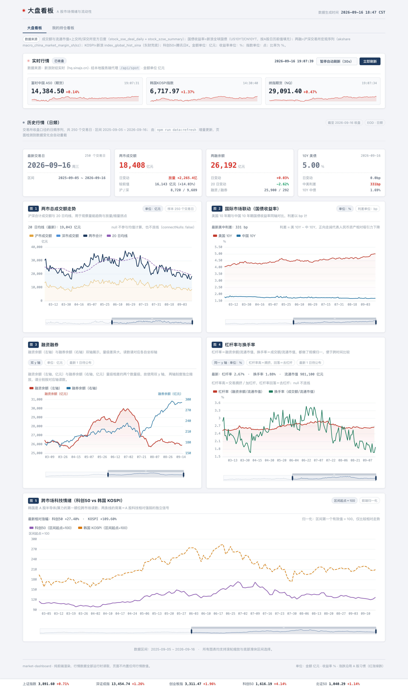
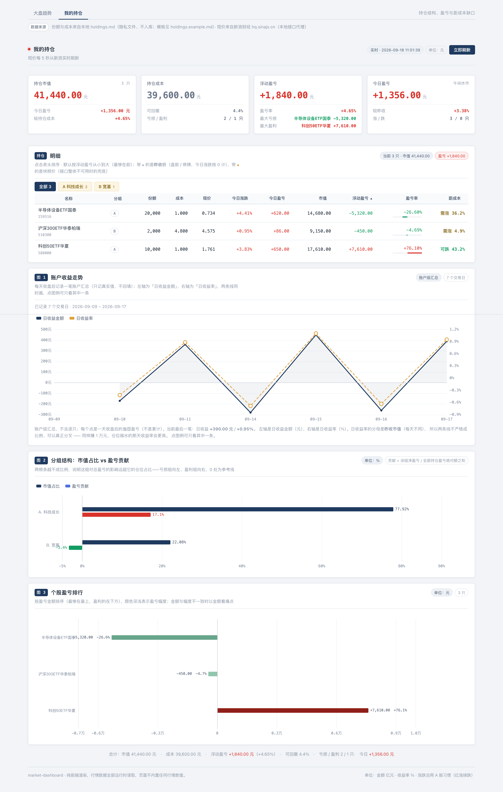

# thinking-ss

个人市场研究工作区。两件事：**A 股/跨市场行情研判**（报告 + 校准日志），以及**一个本地看板**。

> **隐私**：真实持仓与校准日志是本地文件，**不入库**（见文末「隐私」）。所以 clone 下来没有持仓数据是预期状态。

---

## 目录

| 路径 | 说明 |
|---|---|
| `market-dashboard/` | 本地看板（React + Vite + ECharts）。两个视图：大盘看板 / 我的持仓看板 |
| `2026-09-15-A股前瞻报告.md` | 研判报告：《明日A股研判：AI硬件的第二次定价》 |
| `research-2026-09-14-market-facts.md` | 事实核查底稿（所有数值标时点与出处，未查到就写「未查到」） |
| `calibration-log.md` | 校准日志·原始层（**本地，不入库**）——每次判断 + 置信度 + 证伪条件 + 事后回填评分与归因 |
| `holdings.md` | 持仓源文件（**本地，不入库**） |
| `holdings.example.md` | 持仓文件**模板**（随仓库分发，全是编造数据） |
| `glh_live.py` | 抓格隆汇 7×24 快讯（纯标准库，见下） |
| `market-dashboard/scripts/record_holdings_snapshot.py` | 收盘后记录账户收益（`npm run holdings:snapshot`） |

> 账户收益记录不必记着手动跑：`npm start` 会自动检查，**收盘后若当天还没记录就补记一笔**（盘中/非交易日跳过），看板也会在记录落后时提示。
| `update_m1m2.py` + `m1-m2-data.js` + `m1-m2-trend.html` | M1/M2 同比数据与趋势图 |
| `AGENTS.md` | 给编码 agent 的操作手册（环境安装 / 导入持仓） |
| `img/` | README 用的界面截图。**带真实持仓的那张不入库**（见「隐私」） |

---

## 看板

```bash
cd market-dashboard
npm start          # 首次自动 npm ci → http://127.0.0.1:5183
PORT=5190 npm start # 端口被占时换端口
```

唯一硬前置是 **Node `^20.19.0 || >=22.12.0`**；看板本身**不需要 Python、不需要联网**。

- **大盘看板**：底部固定指数条（上证/深成/创业板/科创50/北证50）+ 实时行情面板（A50 / KOSPI / 纳指期货，带日内迷你分时）+ 4 张摘要卡 + 5 张日频折线图
- **我的持仓看板**：4 张总览卡 + 明细表（可排序、分组筛选、以 0 为中心的发散微条）+ 分组结构图 + 个股盈亏排行 + **账户收益走势**（每天收盘后记录一笔，只记真实值、不回填）

完整设计、数据口径与边界见 **[`market-dashboard/README.md`](market-dashboard/README.md)**。

### 界面

**大盘看板** —— 底部固定指数条（上证/深成/创业板/科创50/北证50）+ 实时行情面板（A50 / KOSPI / 纳指期货，带日内迷你分时）+ 4 张摘要卡 + 5 张日频折线图：



**我的持仓看板** —— 4 张总览卡 + 明细表（可排序、分组筛选、以 0 为中心的发散微条）+ 分组结构图 + 个股盈亏排行 + 账户收益走势（每天收盘后自动记一笔）+ 底部合计条：



> 持仓看板这张用的是 `holdings.example.md` 的**示例数据**（3 只持仓，份额与成本全是编造的）。
> 图 3 的收益记录同样是**为截图造出来的示例**（示例份额 × 真实收盘价，共 6 个交易日）——
> 实际使用中它从零开始逐日累积，**不回填历史**。
> **真实持仓的截图请勿入库** —— 见文末「隐私」；`.gitignore` 已把 `img/持仓看板.png` 挡在外面。

---

## 市场分析用到的 skill

分析能力的来源不在本仓库，而在另一个**公开**仓库 **[`HiCooper/agents-silky`](https://github.com/HiCooper/agents-silky)** 里。本仓库的行情研判与数据取数依赖其中两支：

| skill | 作用 | 仓库地址 |
|---|---|---|
| **`economic-analysis-expert`** | 分析身份与操作手册：「快捷问答 / 专业报告」两种模式的结构、行文与红线；多视角交叉验证、情景与证伪条件、两层校准日志约定。**本仓库的研判报告与 `calibration-log.md` 就是按它的流程产出的** | [skills/economic-analysis-expert](https://github.com/HiCooper/agents-silky/tree/main/skills/economic-analysis-expert) |
| **`akshare-data`** | 行情取数 CLI（封装 [akshare](https://akshare.akfamily.xyz/) 的新浪源）。<br>注：它原名叫 `ashare-data`，2026-09 改名为 `akshare-data`；若你手上有改名前的 clone，会找不到 `skills/akshare-data` | [skills/akshare-data](https://github.com/HiCooper/agents-silky/tree/main/skills/akshare-data) |

`akshare-data` 提供的子命令（`$SKILLS/akshare-data/fetch <子命令>`）：

| 子命令 | 取什么 |
|---|---|
| `index` / `indices` | A 股指数（上证/深成/创业板/科创50/沪深300…） |
| `etf` | ETF 行情（半导体/芯片/科技/科创50…） |
| `bond` / `gbond` | 中债 + 美债收益率（也含日/德/英债） |
| `a50` | 富时中国 A50 指数期货 |
| `margin` | 融资融券（两融余额、融资买入额、个股融资余额排行） |
| `turnover` | 两市成交额（量能、放量缩量） |
| `news`（别名 `cls`） | 财联社电报快讯（默认「重点」频道） |
| `us` | 美股指数与个股日线（标普/道指/纳指/**费半 SOX**、AVGO/NVDA/TSM…） |

以上就是 `fetch.py` 命令注册表里的全部条目（`index`/`indices`/`etf`/`bond`/`gbond`/`margin`/`turnover`/`news`/`cls`/`a50`/`us`）。

同仓库里还有几支与本仓库分析无关的 skill（`china-policy-investment-analyzer`、`etf-analyzer`、`knowledge-map`、`windows-cleanup`），需要时可直接取用。

### 这套 skill 怎么挂上

三件事：clone 仓库 → 建 Python 环境 → 把 `skills/` 目录指给 agent。

```bash
git clone https://github.com/HiCooper/agents-silky.git
bash agents-silky/skills/akshare-data/setup.sh   # 建 .venv 并装 akshare（换机器跑一次即可）
```

`setup.sh` 会把虚拟环境建在 `akshare-data/.venv` —— 这个位置是**固定的**，因为 `akshare-data/fetch`
包装脚本硬编码了它。装好后即可取数：`agents-silky/skills/akshare-data/fetch turnover`。

挂载（以 DSH 为例）：skill 是**直接读仓库**的，没有复制、没有软链，在 profile 的 patch 里指一下目录即可：

```yaml
# ~/.dsh/profiles/<profile>/cordis.patch.yml
customSkillDirs:
  - /path/to/agents-silky/skills
```

### 本仓库里的配套脚本

| 脚本 | 用法 |
|---|---|
| `glh_live.py` | `python3 glh_live.py [--limit 5] [--filter 黄金] [--json]` —— 抓格隆汇 7×24 快讯，**只用标准库**，不需要 venv |
| `update_m1m2.py` | `agents-silky/skills/akshare-data/.venv/bin/python update_m1m2.py [月数]` —— 重新生成 `m1-m2-data.js`（默认近 36 个月） |
| `m1-m2-trend.html` | 直接打开，读 `m1-m2-data.js` 画 M1/M2 同比趋势 |

看板侧的历史数据更新（可选，只有想抓新数据时才需要）：

```bash
cd market-dashboard
npm run data:setup      # 一次性：建 .venv-data/ 并装 akshare
npm run data:refresh    # 增量更新（联网，只抓缓存里没有的日期）
```

---

## 隐私

以下内容**只在本地存在**，已被 `.gitignore` 忽略（处理方式同 `.env`）：

| 文件 | 内容 |
|---|---|
| `holdings.md` | 真实持仓（份额 / 成本 / 市值） |
| `market-dashboard/public/holdings.json` | 上者生成的机器可读快照 |
| `market-dashboard/public/holdings-history.json` | 账户每日收益记录（`npm run holdings:snapshot` 累积） |
| `calibration-log.md` | 校准日志（含持仓成本价与组合金额） |
| `img/持仓看板.png` | 持仓看板的截图（整屏都是你的真实金额与份额）。README 用的是同目录 `img/持仓看板示例.png`（示例数据另截一张） |

仓库里只保留模板 **`holdings.example.md`**。首次使用：

```bash
cp holdings.example.md holdings.md                  # 然后填入自己的持仓
cd market-dashboard && npm run holdings:export      # 生成 public/holdings.json
```

因此 **clone 下来持仓看板会显示「暂无持仓数据」并给出上面两条命令 —— 这是预期状态，不是故障**。

> 这三个文件**曾误入 git 历史**，已用 `git filter-branch` 从全部历史中清除并强推（`.gitignore` 里有记录）。
> 若将来又不小心提交，**光删文件不够**，需要同样重写历史。

---

## 数据来源与免责

行情数据来自公开第三方接口（新浪财经、腾讯、财联社、格隆汇、akshare 封装的交易所公开数据），**仅供个人研究**，不构成任何投资建议。所有数值以页面/报告上标注的时点与出处为准；接口可能随时变更或失效。
